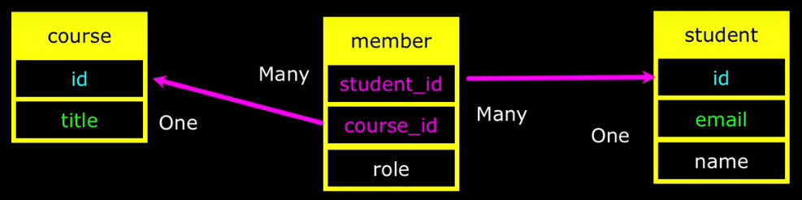

# Data Relationships

### 데이터베이스 디자인

- 데이터베이스를 구성하는 테이블, 각 필드의 이름과 데이터 타입, 그들 사이의 관계 등을 정의하는 것
- 실수가 없도록 구성하고 관계만 잘 나타낼 수 있다면 스타일은 큰 상관 없음

#### 데이터 모델 작성

- 프로젝트에서 어떤 방식으로 데이터를 표현할 지 결정하는 것
- 같은 데이터가 중복되지 않도록 구성해야 함
  - 같은 데이터가 중복 작성되어 있다면, 한 정보를 수정할 때 모든 곳에서 일일이 수정해야 함
- 테이블을 쪼개고, 테이블 사이의 관계를 정의해 데이터 모델을 작성

### 키

- 기본키(Primary key)
  - 각 레코드들을 유일하게 식별하는 키
  - NULL 값을 허용하지 않으며 중복될 수 없음
  - 한 테이블에는 하나의 기본키만 존재함
- 논리키(Logical key)
  - 비즈니스 로직에서 특정 엔티티를 식별하는 키
  - 업무적으로 중요한 필드를 논리키로 지정
  - 자주 바뀌지는 않더라도, 바뀔 가능성이 있기 때문에 기본키로 사용하는 것은 지양
- 외래키(Foreign key)
  - 다른 테이블의 고유한 필드를 참조하는 키
    - 주로 기본키를 참조
  - 테이블 간 관계를 정의하고 무결성을 유지하는 역할
  - 고유한 필드라면 외래키가 참조할 수 있지만, 문자열 필드는 피하는 것이 좋음

### 데이터베이스 정규화

- 데이터 관리 효율성을 높이기 위한 방법
  - 중복 데이터를 줄여 저장 공간을 절약
  - 삽입, 갱신, 삭제 이상을 해결해 데이터 무결성 유지
  - 하나의 데이터를 하나의 테이블에만 두어 모든 관련 데이터가 일관성을 유지
- 1NF: 각 데이터 값은 원자값을 가져야 함
  - 원자값: 더 이상 나눌 수 없는 단일한 값
- 2NF: 1NF를 만족하면서, 부분적 종속이 없어야 함
  - 부분적 종속: 기본키가 일부 필드만 참조하는 종속성, 복합키를 사용하는 테이블에서 발생함
- 3NF: 2NF를 만족하면서, 이행적 종속이 없어야 함
  - 이행적 종속: 기본키가 아닌 필드가 다른 필드를 결정하는 종속성
- 데이터베이스를 정규화하면 일반적으로 효율성이 높아지지만, 과도한 경우 오히려 효율성이 감소할 수 있음

### 관계

- 테이블 간의 관계를 구성함으로써 중복된 데이터를 제거해 데이터를 빠르게 탐색하거나 수정할 수 있음

#### JOIN 구문

- `SELECT` 구문에서 `JOIN`을 사용해 여러 테이블을 결합해 보여줄 수 있음
- `ON`절을 통해 어떤 필드를 기준으로 연결할지 결정해야 함

```sql
SELECT album.title, artist.name
FROM album JOIN artist
ON album.artist_id = artist.id;
```

- `INNER JOIN`: 각 테이블에서 일치하는 항목들만 가져와 결합
- `CROSS JOIN`: 각 테이블의 모든 가능한 조합을 가져와 결합
  - 모든 조합을 확인하기 때문에 `ON`절이 필요없음

#### ON DELETE

- 참조하고 있는 대상이 사라졌을 때 현재 레코드를 어떻게 처리할 지 결정하는 것
- 종류
  - `RESTRICT`: Default로 설정되어 있으며, 참조하고 있는 대상을 삭제할 수 없음
  - `CASCADE`: 참조하고 있는 대상이 삭제되면 레코드도 같이 삭제
  - `SET NULL`: 참조하고 있는 대상이 삭제되면 레코드의 외래키 필드 값을 Null로 변경
    - 외래키 필드가 Null을 허용해야 함

#### 다대다 관계

- 한 테이블의 여러 데이터가 다른 테이블의 여러 데이터를 참조하는 관계
- 중간 테이블을 생성하고 일대다 관계를 만들어 다대다 관계를 표현

<figure style="text-align: center">
  
</figure>