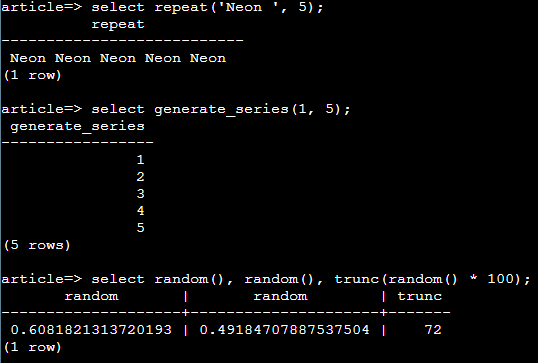
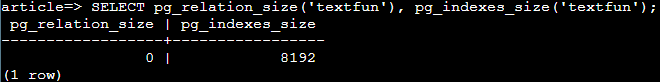
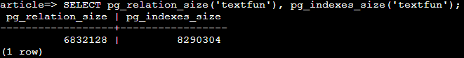
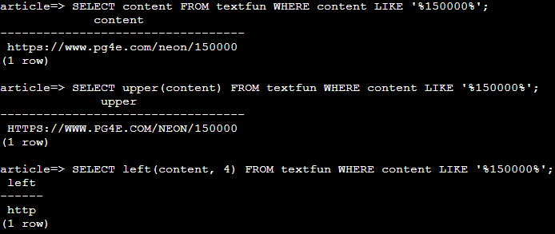
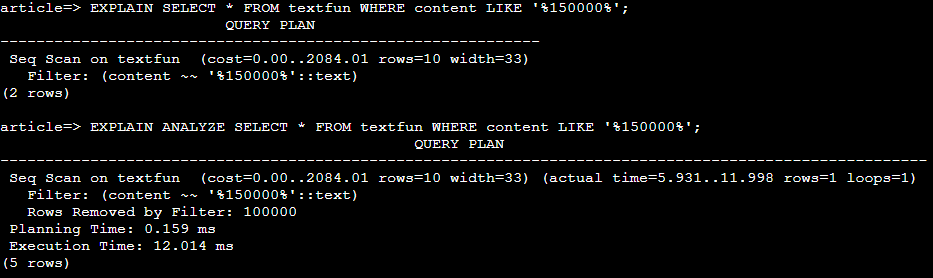
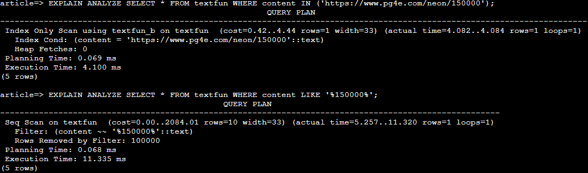

# 텍스트 데이터 다루기

### 테스트 데이터 생성하기

- `repeat`: 주어진 문자열을 특정 횟수만큼 반복
- `generate_series`: 주어진 범위 내 숫자나 날짜 시퀀스를 생성. PostgreSQL 특화 함수
- `random`: 0과 1 사이의 임의의 소수를 생성

<figure style="text-align: center">
  
</figure>

### 텍스트 함수

- 종류
  - `LIKE`, `NOT LIKE`, `<`, `>`, `BETWEEN` 등 `WHERE`절에서 사용할 수 있는 연산자
    - PostgreSQL에는 대소문자를 구분하지 않는 `ILIKE`같은 연산자도 있음
  - `lower()`, `upper()` 등 텍스트를 변환하는 함수
  - 이 외에도 다양한 텍스트 함수가 존재함
    - [PostgreSQL 공식문서](https://www.postgresql.org/docs/17/functions-string.html)
- 테이블과 인덱스를 생성하고 랜덤 데이터 삽입
  
  ```sql
  CREATE TABLE textfun (content TEXT);

  CREATE INDEX textfun_b ON textfun (content);

  INSERT INTO textfun (content) SELECT (
    CASE WHEN (random() < 0.5)
      THEN 'https://www.pg4e.com/neon/'
      ELSE 'http://www.pg4e.com/LEMONS/'
    END) || generate_series(100000, 200000);
  ```

<figure style="text-align: center">
  
  
</figure>

- 텍스트 함수를 이용해 특정 레코드를 조회하거나 변환해 출력

<figure style="text-align: center">
  
</figure>

- 쿼리 실행 분석
  - 쿼리의 실행 계획을 확인하거나 성능을 튜닝할 때 사용
  - `EXPLAIN` 쿼리를 실행했을 때 어떤 전략으로 SQL문을 실행할 지 미리 보여줌
  - `EXPLAIN ANALYZE`: `EXPLAIN` 결과에 더해 실제로 쿼리를 실행하여 수행 시간, 읽은 레코드 수 등을 보여줌

<figure style="text-align: center">
  
</figure>

- 텍스트 스캔
  - content에 대해 인덱스를 생성해두었기 때문에, LIKE를 사용해 패턴을 찾는것보다, IN을 사용해 정확한 값을 찾는 것이 빠름
  - LIKE를 사용하더라도, 값이 정확히 일치하거나 접두어를 검색하는 경우는 인덱스를 사용해서 빠른 편

<figure style="text-align: center">
  
</figure>

### 문자열 집합

- ASCII (American Standard Code for Information Interchange)
  - 표준 ASCII를 기준으로, 7비트로 제어 문자, 영문, 기호 등을 표현하는 문자열 집합
  - `ASCII` 함수로 문자를 아스키 코드로 변환하거나, `CHR` 함수로 아스키 코드를 문자로 변환할 수 있음
- ISO 8859
  - ASCII의 한계를 극복하고 라틴 알파벳 기반 언어를 지원하기 위한 8비트 인코딩 문자열 집합
  - 여러 버전이 있고 각각이 다른 언어권을 지원하지만, 유럽 국가들에 한정되어 있음
- Unicode
  - ISO 8859의 한계를 극복해 다양한 언어의 여러 문자를 표현할 수 있는 문자열 집합
  - 32비트 내에서 가변적으로 문자 당 크기를 잡음
  - 일반적으로 8비트를 사용하고 문자당 크기를 가변적으로 할 수 있는 UTF-8을 사용
    - PostgreSQL에서도 다양한 문자열 집합이 있지만, 기본은 UTF-8을 사용

### 정규표현식

- 정규표현식과 와일드카드를 이용해 문자열 패턴을 찾고 파싱할 수 있음
- 종류
  - `^`: 시작 부분에 일치
  - `$`: 끝 부분에 일치
  - `.`: 임의의 문자 1개와 일치
  - `*`: 임의의 문자 0개 이상과 일치(최대한 긴 문자열을 확인)
  - `*?`: 임의의 문자 0개 이상과 일치(최대한 짧은 문자열을 확인)
  - `+`: 임의의 문자 1개 이상과 일치(최대한 긴 문자열을 확인)
  - `+?`: 임의의 문자 1개 이상과 일치(최대한 짧은 문자열을 확인)
  - `[aeiou]`: 리스트 안에 있는 임의의 문자 1개와 일치
  - `[^XYZ]`: 리스트 안에 없는 임의의 문자 1개와 일치
  - `[a-z0-9]`: 범위 안에 있는 임의의 문자 1개와 일치
  - [PostgreSQL 공식문서](https://www.postgresql.org/docs/17/functions-matching.html)
- `WHERE`절 연산자
  - `~`: 대소문자 구분해서 일치하는지 확인
    - `LIKE`와 다르게 와일드카드 문자 없이도 어디서든 match하는지 확인
  - `~*`: 대소문자 구분하지 않고 일치하는지 확인
  - `!~`: 대소문자 구분해서 일치하지 않는지 확인
  - `!~*`: 대소문자 구분하지 않고 일지하지 않는지 확인
- `substring`함수는 정규표현식을 사용해 문자열에서 매치되는 첫 부분을 가져옴
  
  ```sql
  -- em 테이블의 email에 숫자가 포함되는 레코드의 email에서 첫 번째 숫자 부분을 가져옴
  SELECT substring(email FROM '[0-9]+') FROM em WHERE email ~ '[0-9]';
  ```

- `regexp_matches`함수는 정규표현식을 사용해 문자열에서 매치되는 부분을 가져옴
  - `g` 옵션을 넣으면 모든 부분, 넣지 않으면 첫 부분을 가져옴


  ```sql
  -- em 테이블의 email에 숫자가 포함되는 레코드의 email에서 모든 숫자 부분을 가져옴
  -- 텍스트 배열로 반환하고, 결과가 여러 개면 여러 행으로 반환
  SELECT regexp_matches(email, '[0-9]+', 'g') FROM em WHERE email ~ '[0-9]';
  ```