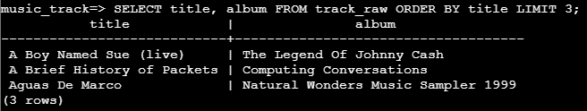
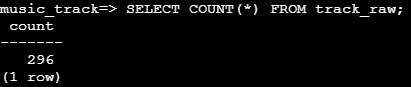

# Musical Track Installation

### Raw Data

#### 데이터베이스 생성

```sql
-- superuser 계정에서 진행
-- pg4e 계정을 owner로 하는 music DB 생성
CREATE DATABASE music WITH OWNER 'pg4e';

-- 필요시 아래 예시와 같이 character set과 템플릿 변경
-- CREATE DATABASE korean WITH ENCODING 'EUC_KR' LC_COLLATE='ko_KR.euckr' LC_CTYPE='ko_KR.euckr' TEMPLATE=template0;
```

- PostgreSQL은 기본 character set이 기본적으로 UTF-8임
- 변경 필요시 `WITH ENCODING` 문으로 설정할 수 있으며, 문자 정렬 방식 및 처리 방식을 결정해야 함
  - `LC_COLLATE`: 문자열 정렬 순서를 결정
  - `LC_CTYPE`: 문자 분류 및 대소문자 처리 방식 등을 결정
- `TEMPLATE`: 데이터베이스 생성시 기본이 될 템플릿을 지정
  - Default는 `template1`이고, 시스템 테이블, 시스템 함수 등 PostgreSQL에서 기본 제공하는 템플릿
  - `template0`는 완전히 비어있는 데이터베이스

#### Raw data 다운로드

```bash
wget https://www.pg4e.com/tools/sql/library.csv
```

#### Raw data용 테이블 생성

```sql
-- 일반 user 계정에서 진행
-- track_raw 테이블 생성
CREATE TABLE track_raw (
  title TEXT, artist TEXT, album TEXT, count INTEGER, rating INTEGER, len INTEGER
);
```

- 생성한 테이블의 상세 정보는 `\d track_raw`로 확인할 수 있음

#### CSV 파일 데이터 삽입

```sql
\copy track_raw (title, artist, album, count, rating, len) FROM 'library.csv' WITH DELIMITER ',' CSV;
```

- `\copy`로 외부 파일에서 데이터를 가져와 테이블에 삽입할 수 있음
  - 테이블의 필드명과 input 데이터의 필드명이 동일하다면, 필드명 작성은 생략할 수 있음
- `WITH DELIMITER`문으로 외부 파일의 구분자를 설정

#### 데이터 확인

```sql
SELECT title, album FROM track_raw ORDER BY title LIMIT 3;
```

<figure style="text-align: center">
  
</figure>

```sql
SELECT COUNT(*) FROM track_raw;
```

<figure style="text-align: center">
  
</figure>

### 테이블 구성

#### 테이블 생성

```sql
CREATE TABLE artist (
  id INTEGER GENERATED ALWAYS AS IDENTITY PRIMARY KEY,
  name VARCHAR(128) UNIQUE
);

CREATE TABLE album (
  id INTEGER GENERATED ALWAYS AS IDENTITY PRIMARY KEY,
  title VARCHAR(128) UNIQUE,
  artist_id INTEGER,
  FOREIGN KEY (artist_id) REFERENCES artist(id) ON DELETE CASCADE
);

CREATE TABLE genre (
  id INTEGER GENERATED ALWAYS AS IDENTITY PRIMARY KEY,
  name VARCHAR(128) UNIQUE
);

CREATE TABLE track (
  id INTEGER GENERATED ALWAYS AS IDENTITY PRIMARY KEY,
  title VARCHAR(128),
  len INTEGER, rating INTEGER, count INTEGER,
  album_id INTEGER REFERENCES album(id) ON DELETE CASCADE,
  genre_id INTEGER REFERENCES genre(id) ON DELETE CASCADE,
  UNIQUE(title, album_id)
);
```

- `GENERATED ALWAYS AS IDENTITY`를 사용해 자동으로 숫자가 증가하도록 설정
  - 시퀀스를 생성해 필드의 값을 관리하며, 직접 숫자를 삽입할 수 없음
  - 시퀀스는 테이블을 삭제하는 경우 같이 삭제됨
  - `SERIAL`을 사용할 수 있지만, 테이블을 삭제하더라도 시퀀스가 남아있다는 단점이 있음

#### 데이터 삽입

```sql
INSERT INTO artist (name) VALUES ('Led Zeppelin', 'AC/DC');

INSERT INTO album (title, artist_id) VALUES ('Who Made Who', 2), ('IV', 1);

INSERT INTO genre (name) VALUES ('Rock'), ('Metal');

INSERT INTO track
  (title, rating, len, count, album_id, genre_id)
VALUES 
  ('Black Dog', 5, 297, 0, 2, 1),
  ('Stairway', 5, 482, 0, 2, 1),
  ('About to Rock', 5, 313, 0, 1, 2),
  ('Who Made Who', 5, 207, 0, 1, 2);
```