# PostgreSQL 활용

### DB 및 테이블 생성

- DB 생성

  ```sql
  -- Superuser 계정에서 DB 생성
  CREATE DATABASE article WITH OWNER pg4e;
  ```

- 테이블 생성을 위한 sql 파일 작성

  ```sql
  CREATE TABLE account (
    id INTEGER GENERATED ALWAYS AS IDENTITY PRIMARY KEY,
    email VARCHAR(128) UNIQUE,
    created_at DATE NOT NULL DEFAULT NOW(),
    updated_at DATE NOT NULL DEFAULT NOW()
  );

  CREATE TABLE post (
    id INTEGER GENERATED ALWAYS AS IDENTITY PRIMARY KEY,
    title VARCHAR(128) UNIQUE NOT NULL,
    content VARCHAR(1024),
    account_id INTEGER REFERENCES account(id) ON DELETE CASCADE,
    created_at TIMESTAMPTZ NOT NULL DEFAULT NOW(),
    updated_at TIMESTAMPTZ NOT NULL DEFAULT NOW()
  );

  CREATE TABLE comment (
    id INTEGER GENERATED ALWAYS AS IDENTITY PRIMARY KEY,
    content TEXT NOT NULL,
    account_id INTEGER REFERENCES account(id) ON DELETE CASCADE,
    post_id INTEGER REFERENCES post(id) ON DELETE CASCADE,
    created_at TIMESTAMPTZ NOT NULL DEFAULT NOW(),
    updated_at TIMESTAMPTZ NOT NULL DEFAULT NOW()
  );

  CREATE TABLE fav (
    id INTEGER GENERATED ALWAYS AS IDENTITY PRIMARY KEY,
    oops TEXT,
    post_id INTEGER REFERENCES post(id) ON DELETE CASCADE,
    account_id INTEGER REFERENCES account(id) ON DELETE CASCADE,
    created_at TIMESTAMPTZ NOT NULL DEFAULT NOW(),
    updated_at TIMESTAMPTZ NOT NULL DEFAULT NOW(),
    UNIQUE(post_id, account_id)
  )
  ```

- sql문 실행

  ```sql
  -- \i로 sql 파일의 sql문을 실행
  \i ./03_create_table.sql
  ```

### 테이블 수정

- post 테이블 content 필드 데이터 타입 `TEXT`로 수정

  ```sql
  ALTER TABLE post ALTER COLUMN content TYPE TEXT;
  ```

<figure style="text-align: center">
  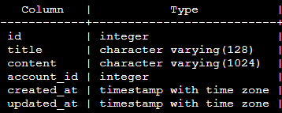
  <br>
  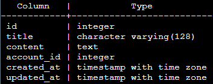
</figure>

- fav 테이블 oops 필드 삭제

  ```sql
  ALTER TABLE fav DROP COLUMN oops;
  ```

<figure style="text-align: center">
  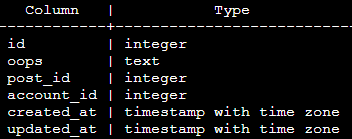
  <br>
  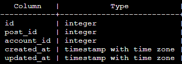
</figure>

- fav 테이블 howmuch 필드 추가

  ```sql
  ALTER TABLE fav ADD COLUMN howmuch INTEGER;
  ```

<figure style="text-align: center">
  
  <br>
  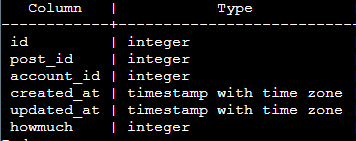
</figure>

### 데이터 삽입

- 데이터 삽입을 위한 sql 파일 작성

  ```sql
  INSERT INTO account(email) VALUES
  ('ed@umich.edu'), ('sue@umich.edu'), ('sally@umich.edu');

  INSERT INTO post (title, content, account_id) VALUES
  ('Dictionaries', 'Are fun', 3),
  ('BeautifulSoup', 'Has a complex API', 1),
  ('Many to Many', 'Is elegant', (SELECT id FROM account WHERE email='sue@umich.edu'));

  INSERT INTO comment (content, post_id, account_id) VALUES
  ('I agree', 1, 1),
  ('Especially for counting', 1, 2),
  ('And I don''t understand why', 2, 2),
  ('Someone should make "EasySoup" or something like that',
    (SELECT id FROM post WHERE title='BeautifulSoup'),
    (SELECT id FROM account WHERE email='ed@umich.edu')),
  ('Good idea - I might just do that',
    (SELECT id FROM post WHERE title='BeautifulSoup'),
    (SELECT id FROM account WHERE email='sally@umich.edu'));
  ```

- sql문 실행

  ```sql
  \i ./03_load_data.sql
  ```

### DISTINCT문 활용

- 테이블 생성

  ```sql
  CREATE TABLE racing (
    make VARCHAR,
    model VARCHAR,
    year INTEGER,
    price INTEGER
  );
  ```

- 데이터 삽입

  ```sql
  INSERT INTO racing (make, model, year, price) VALUES
  ('Nissan', 'Stanza', 1990, 2000),
  ('Dodge', 'Neon', 1995, 800),
  ('Dodge', 'Neon', 1998, 2500),
  ('Dodge', 'Neon', 1999, 3000),
  ('Ford', 'Mustang', 2001, 1000),
  ('Ford', 'Mustang', 2005, 2000),
  ('Subaru', 'Impreza', 1997, 1000),
  ('Mazda', 'Miata', 2001, 5000),
  ('Mazda', 'Miata', 2001, 3000),
  ('Mazda', 'Miata', 2001, 2500),
  ('Mazda', 'Miata', 2002, 5500),
  ('Opel', 'GT', 1972, 1500),
  ('Opel', 'GT', 1969, 7500),
  ('Opel', 'Cadet', 1973, 500);
  ```

- make 필드에서 중복값 제외하고 조회

  ```sql
  SELECT DISTINCT make FROM racing;
  ```

<figure style="text-align: center">
  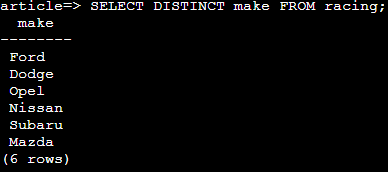
</figure>

- model 필드에서 중복값을 제외하면서 make, model, year 필드 조회
  - ORDER BY를 지정하지 않으면 임의의 레코드를 가져옴
  - ORDER BY를 지정하면 정렬 결과의 마지막 레코드를 가져옴
    - ORDER BY에는 DISTINCT ON으로 확인할 필드가 반드시 가장 먼저 와야 함

  ```sql
  SELECT DISTINCT ON (model) make, model, year FROM racing;
  SELECT DISTINCT ON (model) make, model, year FROM racing ORDER BY model, year;
  SELECT DISTINCT ON (model) make, model, year FROM racing ORDER BY model, year DESC;
  ```

<figure style="text-align: center">
  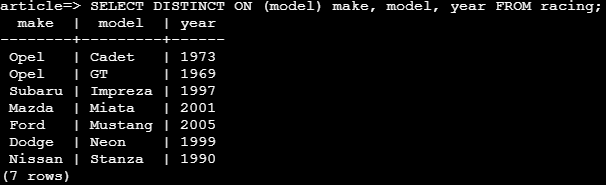
  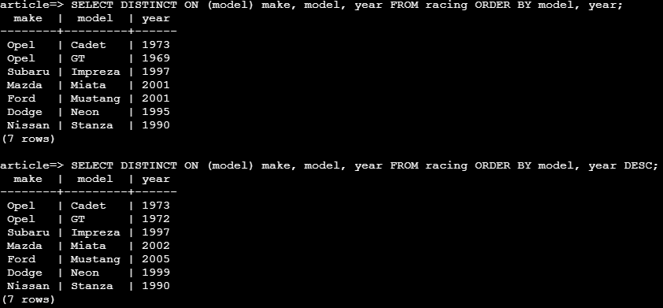
</figure>

### GROUP BY문 활용

- Built-in 테이블인 pg_timezone_names 사용
- 서머타임 적용 여부에 따른 개수 확인

  ```sql
  SELECT COUNT(is_dst), is_dst FROM pg_timezone_names GROUP BY is_dst;
  ```

<figure style="text-align: center">
  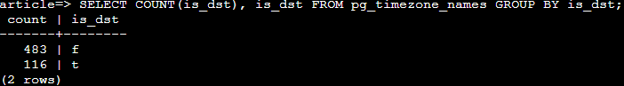
</figure>

- 서머타임 적용중인 시간대에 한해 각 시간대별로 그룹화한 개수 확인

  ```sql
  SELECT COUNT(abbrev), abbrev FROM pg_timezone_names WHERE is_dst = 't' GROUP BY abbrev;
  ```

<figure style="text-align: center">
  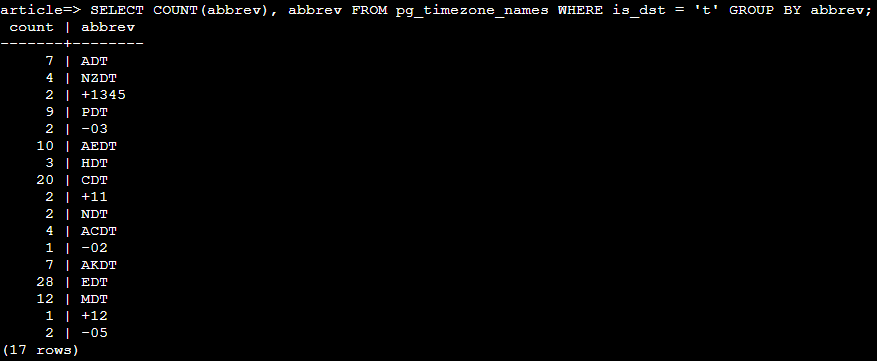
</figure>

- 서머타임 적용중인 시간대에 한해 각 시간대별로 그룹화한 개수가 10 초과인 경우 확인

  ```sql
  SELECT COUNT(abbrev), abbrev FROM pg_timezone_names WHERE is_dst = 't' GROUP BY abbrev HAVING COUNT(abbrev) > 10;
  ```

<figure style="text-align: center">
  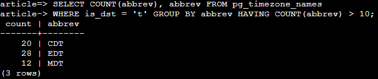
</figure>

### 서브쿼리 활용

- account_id가 email이 'ed@umich.edu'인 레코드의 account_id와 동일한 레코드의 content를 조회

  ```sql
  SELECT content FROM comment WHERE account_id = (
    SELECT id FROM account WHERE email='ed@umich.edu'
  )
  ```

<figure style="text-align: center">
  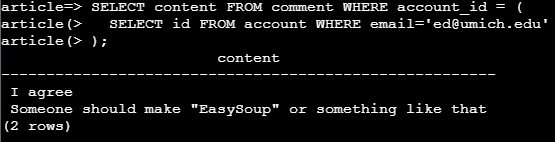
</figure>

- 서머타임 적용중인 시간대에 한해 각 시간대별로 그룹화한 개수가 10 초과인 경우 확인
  - FROM 절에 서브쿼리를 이용하는 경우 반드시 AS로 별칭을 지정해야 함

  ```sql
  SELECT ct, abbrev FROM (
    SELECT COUNT(abbrev) AS ct, abbrev FROM pg_timezone_names
    WHERE is_dst = 't' GROUP BY abbrev
  ) AS zap WHERE ct > 10;
  ```

<figure style="text-align: center">
  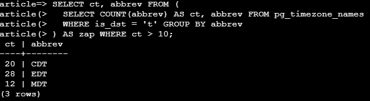
</figure>

### 트랜잭션

- 트랜잭션으로 데이터를 변경하면 실행되는 동안 행을 잠그기 때문에 다른 쿼리문으로 접근할 수 없음
  - 트랜잭션이 끝난 후 실행되거나, timeout됨
  - 트랜잭션이 실행중인 경우 해당 창의 프롬프트가 `=*>`로 표시됨

<figure style="text-align: center">
  
  <figcaption>트랜잭션 실행 중</figcaption>
  <br>
  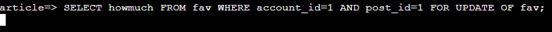
  <figcaption>테이블이 잠겨 쿼리문이 실행 대기 상태</figcaption>
  <br>
  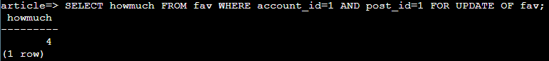
  <figcaption>ROLLBACK이나 COMMIT으로 트랜잭션을 종료해야 실행됨</figcaption>
</figure>

### 트리거

- 특정 동작이 감지되면 트리거 함수를 수행

  ```sql
  -- 트리거 함수 선언: updated_at을 현재 시간으로 변경
  CREATE OR REPLACE FUNCTION trigger_set_timestamp()
  RETURNS TRIGGER AS $$
  BEGIN
    NEW.updated_at = NOW();
    RETURN NEW;
  END;
  $$ LANGUAGE plpgsql;

  -- post 테이블이 업데이트되기 전에 트리거 함수를 실행
  CREATE TRIGGER set_timestamp
  BEFORE UPDATE ON post
  FOR EACH ROW
  EXECUTE FUNCTION trigger_set_timestamp();

  -- fav 테이블이 업데이트되기 전에 트리거 함수를 실행
  CREATE TRIGGER set_timestamp
  BEFORE UPDATE ON fav
  FOR EACH ROW
  EXECUTE FUNCTION trigger_set_timestamp();

  -- comment 테이블이 업데이트되기 전에 트리거 함수를 실행
  CREATE TRIGGER set_timestamp
  BEFORE UPDATE ON comment
  FOR EACH ROW
  EXECUTE FUNCTION trigger_set_timestamp();
  ```

<figure style="text-align: center">
  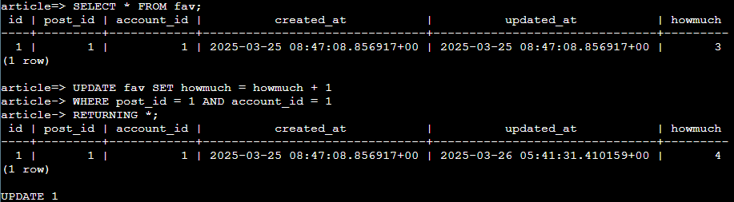
</figure>