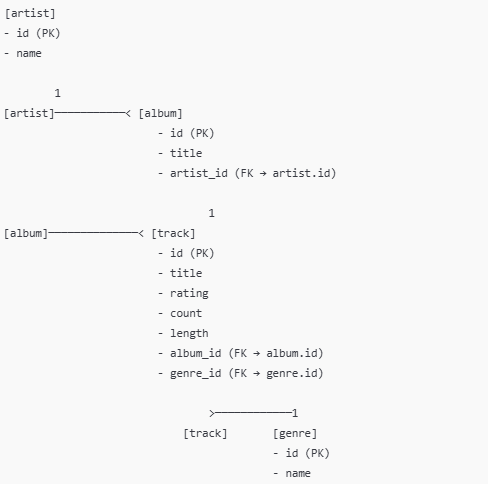

# 학습 목표
- 관계형 데이터 베이스 디자인
- One-to-many 데이터 모델
- Primary, logical, and foreign keys의 함수들
- row들을 어떻게 일치하는 테이블의 데이터와 연동하는지

## 1. Database Design
- ERD에 관한 소개

## 2. Building a Data Model
- ERD를 그리는데 어떻게 `objects`와 그 `relationships`을 표현할 것인지 고려해야 한다.
- Basic Rule
    - 같은 데이터를 두 번 중복하는 대신 `relationship`을 사용할 것.
- 현실 세계에도 `단 하나`만 존재하는 무엇이 있다면, 데이터 베이스에서도 이에 해당하는 데이터는 `단 하나`만 존재해야 한다.
- 그러니까 `중복`이 없는 게 중요하다.

### 2-1. 왜 중복을 없애야 할까?
- CSV 파일이나 sheet을 보면 동일한 내용이 여러 줄에 `중복`되어 있는 걸 볼 수 있다. (이를 `수직 중복` 문제라 함).
    - 문제가 발생하면 모든 행을 수정해야 하는 문제가 생긴다.
    e.g. 강의는 다른데 같은 교수님의 강의라면 `교수님 이름`이 `반복`됨.
- 위처럼 중복되는 정보는 `새로운 table로 분리`하면 중복 없이 데이터를 구현할 수 있다.
    - 또한 문제가 발생하여도 한 번의 수정으로 완료가 된다.
    - Why? 데이터가 수십, 수샙으로 커지면 중복도 그만큼 늘어나기 때문에 분리하는 것이 효율적.
- **핵심은 UI는 CSV처럼, 그러나 DB는 `중복 없이`이 설계한다.**

### 2-2 DB 설계 순서 요약
1. UI 분석
2. 반복되는 데이터 `table로 분리`
3. 각 table에 `primary key` 부여
4. `관계(foreign key)`를 통해 테이블 연결
5. `ERD` 그림 작성

## 3. 테이블 설계 고려사항
1. 해당 컬럼이 하나의 `객체`인지 혹은 다른 객체의 `속성`인지 확인한다.
2. 객체를 정의하면 다른 객체들과의 `relationships`를 정의해야 한다.

### 3-1. Music system 예
#### 1. 중심 테이블 찾기
- Track이 중심 테이블이 됨. (음악이기 때문에 유일함).

#### 2. 테이블 구성 살펴보기
- title: track의 제목 (문자열 + 고유 속성)
- album
- artist
- genre
- rating: 평가 점수 (숫자)
- count: 재상 횟수 (숫자)
- length: 길이 (숫자)

#### 3. 수직 중목이 있는 컬럼 별도 테이블로 분리
- album: 여러 title이 하나의 album에 속함
- artist: 여러 album이 하나의 아티스트에 속함.
- genre: 여러 title이 동일한 genre를 가질 수 있음.

#### 4. 테이블 간의 관계 정리. (N인 쪽이 Foreign key가 됨).
- artist & album = 1 : N
- album & track = 1 : N
- track & genre = N : 1

#### 5. Genre는 어디에 위치?
- artist: 하나의 artist에 모든 곡의 장르가 종속. (가장 유연하지 않음).
- album: 앨범 단위로 장르가 통일될 가능성. (평범)
- track: 같은 앨범 내에서도 다양한 장르 가능. (가장 유연함).

#### 6. 요약
- 중복되는 `문자열`은 별도 테이블로 분리, Foreign key 참조
- `숫자 속성은 유지`. 복제해도 비용이 적게 들어가기 때문.
- Objects간 `1 : N` 혹은 `N : 1` 명확히 연결
- 속성 위치에 따른 `유연성`을 고려. (e.g. Genre).