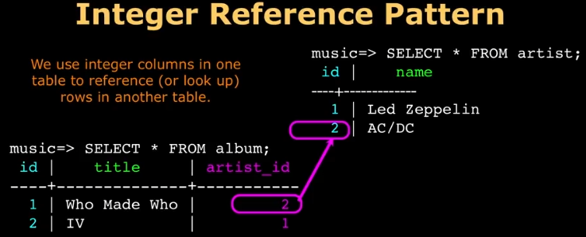
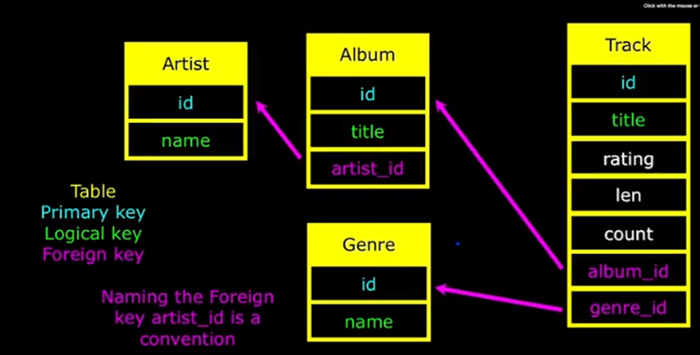

# Normalization?

## 1. DB 구축 핵심
- 많은 DB 이론이 있지만 하단의 세 가지는 지켜져야 한다.
    1. Do not replicate string data.
        - 대신 데이터를 참조하게 만들 것.
    2. Use integers for keys.
    3. Add a special `key` column to each table.
        - 참조할 테이블에 특별한 `key`를 추가해라.

### 1-1. Sample

- album 테이블에서 artist 테이블을 참조.
    - 핵심은 name이라는 문자열 데이터를 artist 테이블에 `압축(compresison)`하여 참조한다.
    - 즉, 문자열의 `중복`을 해결하고, `숫자`로 이를 참조한다.
- 참조를 하는 테이블(album)은 `artist_id`라는 foreign key를 갖는다.
    - 표기: 참조 주체에서 화살표가 나가고, 참조 대상이 되는 테이블에 화살표가 들어간다.
    - e.g. track.album_id -> album.id 혹은 album.artist_id -> artist.id 혹은 track.genre_id -> genre.id
- 다시 이야기하지만 Foreign key는 `참조 테이블 명_id`로 컬럼명을 명명하여 직관적으로 알아보게 한다.

## 2. 관계 구성 순서

1. Logical key 구상 (논리)
    - `사람`이 직접 `UI`에서 `검색`하고 `구별`하는 기준이 된다.
        - `문자열` 기반의 키
        - `Logical key인 컬럼은 자주 사용될 것 같으니 idx로 만든다`라는 의미도 내포됨.
    - 즉, 데이터 모델 설계의 중심축이 된다.
    - 또한, 로직을 중심으로 우선적으로 테이블을 정의할 수 있다.
2. Primary key
    - 테이블 내의 고유식별자이다. (숫자형 id)
    - 논리적으로 테이블이 정의된 상태에서 `테이블 내부의 고유성`을 보장한다.
3. Foreign key
    - `테이블 간의 관계`를 정확히 연결한다.
    - 다른 테이블의 `primary key`를 참조한다.